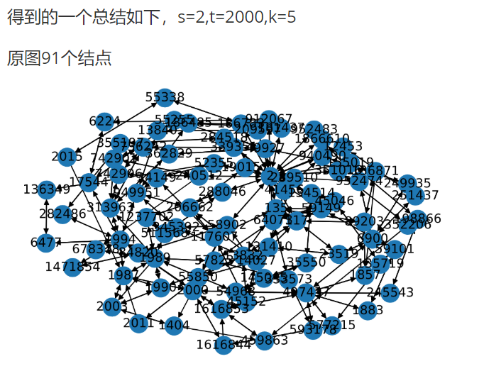
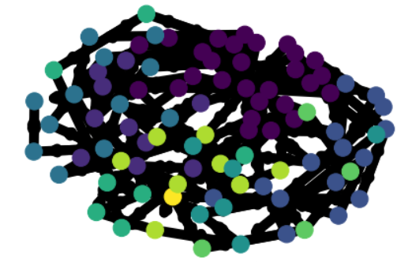
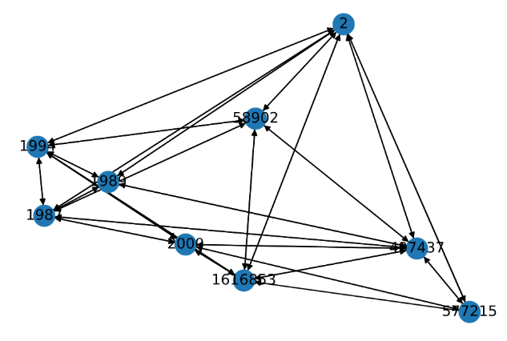
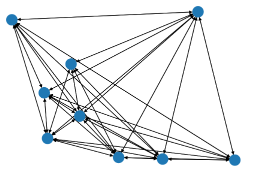
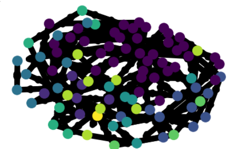
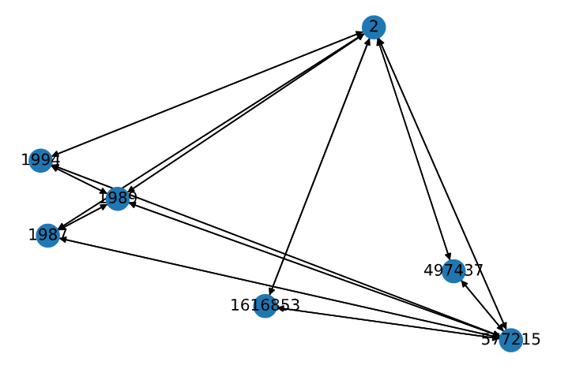
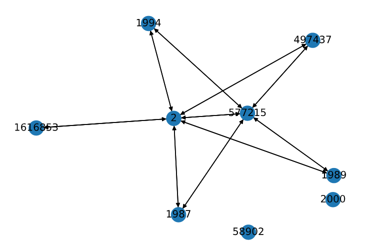

我观察到子图大致少于$10^4$个结点，远小于原图。在子图可以采用复杂度更高的算法。因此先找子图再在其上操作。st-k hop子图的summarization分为三步：找子图，计算betweenness，cluster。

找st k-hop子图：一个简单的双向搜索可以解决问题。

大致思路是从s，t两结点开始bfs，每次bfs搜索深度+1，在结点较少的一侧搜索，一共k次。找到从s，t bfs都能到达的点，之后从这些点出发向两边查找。可以得到子图中的点到s，t的距离。

$O(k|E|)$

之后在找到的子图用到t的距离进行剪枝，从s出发dfs找到所有路径。性能高于已有的SOTA方法BC_DFS。

用C++11实现后发现这一算法在soc-Journal数据集（4.8 M结点）上运行时间对k的变化不敏感。任取s，t在$k\le 15$的范围内平均找子图时间不超过5e-3 s。代码见

以下部分只有python实现。

betweenness：

为了计算，首先在整个图上进行pagerank，dump factor尽量高。

使用random walk betweenness，即使用从s到u的随机游走经过u的概率作为u的betweenness。为了只考虑k步以内的路径，并且加快计算，因此修改这一betweenness的定义。

k-hop random walk betweenness。从s到t路径长度不大于k的随机游走经过s的概率。

使用如下方法：

从s出发进行随机游走或者push操作，得到经过$l$步随机游走从s到达u的概率$p_{su}^l$。复杂度O(km)。

而从任意结点v经过长度为$l$的随机游走到达t的概率可以使用time-reverse markov chain 计算。先在整个大图上计算pagerank，得到$\pi(u)$。然后从t出发沿入边依据概率。假设u点的一个前驱为v ，以$p_{u\to v}'=\frac{\pi(u)}{\pi(v)\deg^+(u)}$反向随机游走。即可得到$p^l_{ut}$。复杂度O(km)

由此可以得到得到经过$l$步随机游走从v第一次到达t的概率$f_{su}^l$。证明略
$$
f_{vt}^{1}=p_{vt}^{1}\\
f_{vt}^{l+1}=p^{l+1}_{vt}
-\sum_{k=1}^np_{vt}^{l+1-k}f_{tt}^k
$$
复杂度$O(k^2 n)$

由此可以计算从s经过u，k-hop随机游走到t的概率。
$$
p(u|k)=\sum_{k_1=1}^kp_{su}^{k_1}f_{ut}^{k-k_1}\\
$$
而u的betweenness可以如下计算
$$
p(u)=\sum_{l=1}^k p(l)p(u|l)
$$
复杂度$O(k^2n)$。$p(u|l)$是u在所有从s到k长为l的路径中的重要性，$p(l)$则可以理解为不同长度路径的重要性。可以直接取为$\frac{1}{k}$。

不计PageRank预计算则总复杂度为$O(k^2|V|+k|E|)$，这里的点集边集都是小图点集边集的大小。

**Cluster**

找出了between比较大的节点后可以直接给每个重要结点赋一种颜色，进行colored random walk。cluster每个cluster的标签直接用seed的label。

cluster结果：（颜色表示colored random walk的结果）

总结9个结点。

另外，也尝试使用node2vec生成embedding，然后对embedding使用kmeans算法进行分类，生成的子图如下。

注意到最左侧的三个结点形成了团。它们应该被归入同一个cluster。这说明每个seed都成一个cluster是不合理的，因此进行剪枝。（但是奇怪的是node2vec的embedding中这三个结点的embedding也不临近）。

原有的colored random walk会将结点的颜色向量强制分开，因此改变转移矩阵的形式。

设一般随机游走的状态转移矩阵为$P_{ij}$，表示j状态游走到i状态的概率。试图使用如下的状态转移矩阵进行colored random walk。
$$
M_{ij}=\frac{P_{ij}(1+\lambda\sum_{l}c_{i,l}c_{j,l})}{
\sum_{i'}P_{i'j}(1+\lambda\sum_{l}c_{i',l}c_{j,l})
}
$$
颜色越相似权重越大。

它不保证收敛。并且我认为colored random walk中使用衰减函数的做法很麻烦，因此我引入另一种方法。

随机游走逐步得到$P_1,P_2,...$

将前n项的平均值记作$\bar{P}_n=\frac{\sum_{i=1}^n P_i}{n}$，而
$$
|\bar{P}_{n+1}-\bar{P}_n|=|\frac{\sum_{i=1}^n P_i+P_{n+1}}{n+1}-\frac{\sum_{i=1}^n P_i}{n}|
=|-\frac{\sum_{i=1}^n P_i}{n(n+1)}+\frac{P_{n+1}}{n+1}|\\
=\frac{1}{n+1}|\bar P_n-P_{n+1}|\le \frac{2}{n+1}
$$
从数值计算的角度来说$\bar P_{n}$是可以收敛的。

首先不剪枝，得到的cluster结果与colored random walk十分接近。

利用不同颜色分布的互信息将一些颜色合并

减去两个颜色时：

仍然不够稀疏。改变思路，不是删除一些点而是删除一些边。

如果两个cluster中存在点相连则边相连这一条件使得cluster之间边的密度较大。可以对每条边赋一个权重，两个cluster之间有边仅当所有点之间的边的权重和最大。

认为如果一条边连接的两个点的颜色分布KL散度较大时这条边所含的信息量大。由此对边进行删除，得到。

**尝试使用RDF**：之前的问题在于没有办法对结果进行衡量，并且根据综述来看单纯用结构信息进行总结已经过时了。但是目前上手RDF后发现工程能力不足。现在想先停下s,t k-hop子图方面的工作，写一些有关知识图谱。

